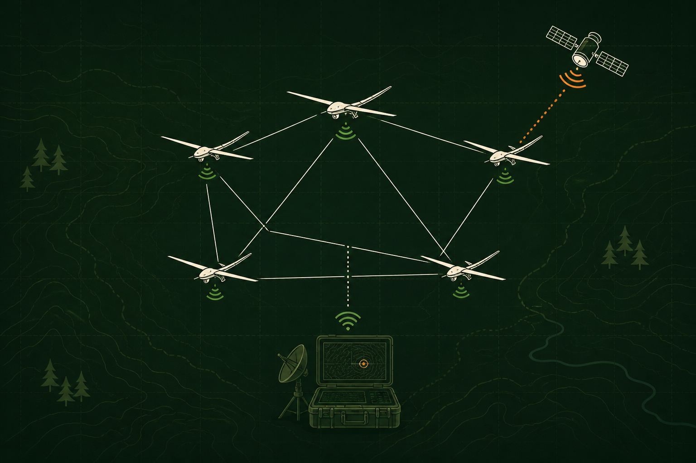

# AVIAN Ground UI

A lightweight, operationally read-only field dashboard for AVIAN ground devices. It surfaces
local agent readiness, mesh peers, selected underlays, synchronized aircraft
telemetry, radio health, payload synchronization, warnings, and bounded
sanitized service logs. Aircraft telemetry refreshes every 2 seconds, status
every 10 seconds, and the heavier log and record feeds every 30 seconds;
background tabs pause polling and manual refresh is always available. The last
good aircraft sample remains visible and is explicitly marked stale when a
link is interrupted. Active warnings expand in place, and the bounded
200-entry event view supports search, severity/service filters, ordering, and
pagination.



## Safety boundary

- The HTTP listener is hard-limited to loopback addresses.
- Every request must use the exact configured loopback `Host`; browser `Origin`
  headers, when present, must match that same HTTP origin. This blocks DNS
  rebinding and cross-origin reads of the local service.
- Flight APIs contain only health, status, record-listing, and fixed AVIAN
  journal queries. There is no emergency-command route. The one local mutation
  route accepts only a bounded, versioned `AVIAN1` aircraft connection code,
  requires an explicit setup header, and forwards a validated public peer
  descriptor to the owner-only local agent.
- Status and aircraft telemetry are parsed and projected into fixed display
  schemas. The aircraft projection contains only flight state needed by the
  operator: source, observation time, position and its availability, altitude, velocity, attitude,
  battery/control-link state, armed/landed state, and failsafe state. Peer
  addresses, endpoint identifiers, command state, raw radio-device details,
  and source error strings never cross the browser boundary.
- The generic record endpoint permits only bulk and acknowledgement records.
  Responses contain only publication timestamps; record IDs, sources,
  payloads, paths, and image bytes are discarded by the bridge. The dedicated
  aircraft endpoint issues a fixed telemetry query and returns only the latest
  validated projection per aircraft source.
- AVIAN control messages, responses, journal bytes, log lines, record limits,
  concurrent browser fetches, and timeouts are bounded.
- The journal command is invoked directly with fixed units and arguments; no
  shell or caller-supplied command text is used.
- Credential markers, authorization/bearer values, imagery paths, and JPEG data
  are defensively redacted from normalized status errors and journal messages.
- Missing or stale sources appear as offline/degraded and are never replaced by
  sample values.
- The dashboard is a separate process and failure domain from `mesh-agent`.

The bridge runs as the existing `avian` service user because AVIAN's command-
capable control socket is intentionally owner-only. The bridge code exposes no
command request, but the process remains trusted ground software and is kept on
loopback with a restrictive systemd sandbox.

## Architecture

```text
Browser on ground device
        │ HTTP 127.0.0.1:4178 (flight view + local aircraft setup)
        ▼
avian-ground-ui (Rust)
        ├── local ground-agent socket  status + synchronized records only
        ├── journalctl                 optional, fixed AVIAN units + sanitized
        └── ground-dist/             exported React dashboard
                 ▲
                 │ PEAT records over the selected AVIAN underlay
                 │ (direct Ethernet/Silvus, then ZeroTier-over-satellite)
                 │
           aircraft mesh-agent ── Cube MAVLink
```

The Sites/vinext project under `app/` produces both the development preview and
the static bundle used by the local Rust service. The operational page is local
only because a hosted page cannot safely or reliably access a device-local Unix
socket.

## Development

Requirements:

- Node.js 22.13 or newer
- Rust 1.91.1 or newer

```sh
npm ci
npm run lint
npm test
cargo fmt --all --check
cargo clippy --all-targets --locked -- -D warnings
cargo test --locked
```

`npm test` performs the vinext build, exports `ground-dist/`, rejects source or
development-only paths in the rendered HTML, and checks the rendered shell.
The `rolldown` override is intentionally pinned to 1.2.4 because the 1.2.5
package references two unpublished native bindings and breaks clean Linux
`npm ci`; remove the override only after the upstream package is complete.

Run the operational server locally:

```sh
npm run export:ground
cargo run --locked -- --assets ground-dist --control-socket /run/avian/control.sock
```

On macOS, where systemd's journal is not present, add `--disable-journal` and
point `--control-socket` at the local ground agent's Unix socket.

Open [http://127.0.0.1:4178/](http://127.0.0.1:4178/).

## Connect or remove an aircraft

The aircraft and ground installation must already have the same protected
formation credential. The credential is never put in the browser or connection
code.

1. Power on the aircraft and join its local or approved overlay network.
2. Select **Manage aircraft** in AVIAN Ground.
3. Paste the aircraft's `AVIAN1.` code and select **Connect aircraft**.

The local agent validates the formation and public peer descriptor, persists it
atomically in its private state, and attempts the connection immediately. No
SSH, TOML editing, endpoint-ID copying, or service restart is required. An
aircraft provisioner creates the non-secret code on the aircraft with:

```sh
sudo avianctl connection-code \
  --address ethernet=192.168.2.2:9000 \
  --address satellite=10.210.122.229:9000
```

Connection codes are for simple pre-provisioned ground formations. Managed
formations continue to use AVIAN membership manifests.

To remove a code-added aircraft from this ground device, open **Manage
aircraft**, select **Remove** beside its name, then select **Confirm remove**.
The local agent atomically removes the saved public descriptor, stops
outbound reconnection attempts, and closes its currently tracked transport. It
does not modify the aircraft or revoke formation membership or credentials.
An authorized aircraft or formation peer can still establish an inbound or
relayed mesh path, and synchronized telemetry remains subject to normal record
retention. Paste the code again to restore the ground-initiated direct pairing.
Static and managed-membership peers are never offered for removal.

## Flight operation

Run both `mesh-agent` and this service on the operator device. The browser then
talks only to loopback, while aircraft data reaches the local agent as
synchronized AVIAN telemetry records. Do not point the browser directly at an
aircraft web server and do not depend on an SSH tunnel to the aircraft during
flight.

Configure at least two ordered peer addresses when available: the preferred
local RF/Ethernet address and a ZeroTier address carried by the satellite
underlay. AVIAN reconnects through the next reachable address. During an
interruption the page stays available, preserves the last good sample, labels
it `Last known`, and raises a stale-data warning; it resumes `Live` after fresh
records arrive. A transport transition is break-before-make in the current
milestone, so a short telemetry gap is expected.

## Remote operator access

Keep the service on loopback and use an SSH tunnel when the browser runs on a
separate operator laptop:

```sh
ssh -N -L 4178:127.0.0.1:4178 operator@ground-device
```

Then open [http://127.0.0.1:4178/](http://127.0.0.1:4178/) on the laptop. This
is appropriate only when AVIAN Ground runs on a separate ground computer. The
dashboard and AVIAN services continue running if the laptop link is removed,
but an SSH tunnel cannot migrate between Ethernet, Wi-Fi, and overlay paths.
For flight, prefer running the Ground service on the same operator Mac as the
browser so no SSH session is in the critical display path.

`jq` is not required. Operators may install it for interactive shell filtering,
but the service, installer, checks, and runbooks rely only on their declared
Rust, Node.js, system, and Python tooling.

## Linux installation

Install AVIAN first, then:

```sh
sudo ./deploy/install.sh --enable
```

For a Pi without Node/Rust build tooling, build elsewhere and supply
`--bin-dir` and `--assets-dir`. The installer creates no network exposure and
preserves AVIAN, stardogOS, MAVLink, radio, RFD900, GPS Guard, and video paths.

Useful checks:

```sh
systemctl status avian-ground-ui.service
curl --fail http://127.0.0.1:4178/api/v1/health
journalctl -u avian-ground-ui.service --since today
```

## API

| Route | Purpose | Bounds |
| --- | --- | --- |
| `GET /api/v1/health` | Bridge health and operational safety boundary | Fixed response |
| `GET /api/v1/status` | Fixed, display-only AVIAN status projection | schema v1, 3 s / 1 MiB |
| `GET /api/v1/aircraft` | Latest validated synchronized flight state per aircraft | telemetry only, 100 records, 3 s / 1 MiB |
| `GET /api/v1/records?class=bulk&limit=20` | Publication timestamps only | bulk/ack allowlist, 1–100 |
| `GET /api/v1/logs?lines=80` | AVIAN mesh/link service journal | fixed units, 1–200 lines / 1 MiB |
| `GET /api/v1/connections` | List removable connection-code aircraft by name | no addresses, identities, or credentials |
| `POST /api/v1/connections` | Validate and persist one public aircraft descriptor | same-origin + setup header, 16 KiB body, no formation secret |
| `DELETE /api/v1/connections/{name}` | Remove one connection-code aircraft from this ground device | same-origin + setup header, validated name, static/managed peers rejected |

All API responses are non-cacheable and carry restrictive browser security
headers. Static assets are served from the same origin. Requests with any other
authority receive HTTP 421; requests with a foreign origin receive HTTP 403.
